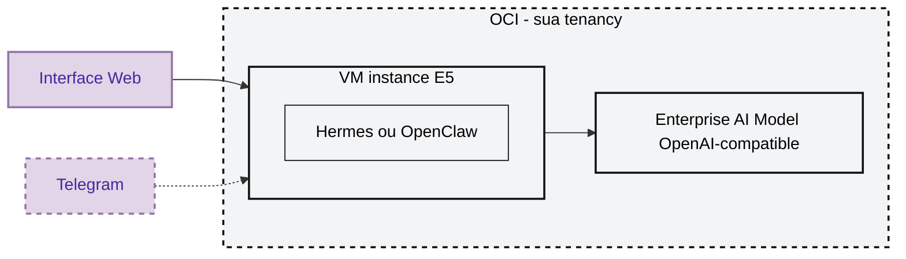

# Seu Agente na OCI com OpenClaw ou Hermes

Crie um agente próprio rodando dentro da sua OCI, com uma URL para conversar pelo navegador. A ideia é simples: a infraestrutura fica na sua tenancy, a VM roda o OpenClaw ou o Hermes, e as chamadas ao modelo passam pelo OCI Generative AI usando autenticação da própria instância.

Você não precisa colar API key de modelo, token de Telegram ou chat id. A stack sobe tudo, testa tudo e só termina com `Succeeded` quando o agente estiver pronto de verdade.

## Em Uma Frase

Você sobe uma stack, escolhe `openclaw` ou `hermes`, espera alguns minutos e recebe uma URL pronta para abrir o seu agente.

## Arquivo

Use este pacote:

```text
openclaw-hermes-oci-principal-v14.zip
```

Ele cria uma VM com `2 OCPU` e `16 GB` de RAM. A stack tenta usar `VM.Standard.E5.Flex` primeiro e, se precisar, tenta `VM.Standard.E6.Flex`.

O app é leve. Para uma versão mais econômica, ele também pode rodar em A1 Always Free, mas este pacote prioriza E5/E6 porque costuma ter uma experiência de subida mais previsível.

## O Que Fica Na OCI

Quase tudo que importa fica dentro da sua OCI:

- a VM onde o agente roda;
- a rede da VM;
- as regras de acesso;
- o app escolhido, OpenClaw ou Hermes.
- o acesso ao modelo enterprise via OCI Generative AI.

A pessoa conversa por fora, usando a interface web. Se você quiser, depois também pode conectar canais como Telegram no app. O agente e o modelo ficam do lado da OCI.



Em termos práticos:

- Fora da OCI fica a forma de interação: navegador e, se configurado depois, Telegram.
- Dentro da OCI fica a VM com Hermes ou OpenClaw.
- A VM conversa com o OCI Generative AI em formato OpenAI-compatible.
- O modelo é enterprise, consumido sob demanda e com proposta de zero retenção para inferência.

Para explicar de forma simples: a infraestrutura fica na sua OCI, e o modelo é consumido pelo OCI Generative AI com uma proposta de zero retenção para inferência. Segundo a documentação de tratamento de dados do serviço, prompts e respostas usados em inferência não são armazenados dentro do OCI Generative AI, e também não são compartilhados com provedores terceiros. Referência oficial: <https://docs.oracle.com/pt-br/iaas/Content/generative-ai/data-handling.htm>

## Custo, Sem Complicar

Pense no custo em três partes:

| Parte | Como pensar |
| --- | --- |
| Rede | VCN, subnet, route table e security list não cobram por existir. Para esse teste, pense na rede base como grátis; tráfego de saída pode seguir regras de cobrança da OCI. |
| VM | A VM paga por hora enquanto estiver ligada. Se desligar, para de consumir computação. O boot volume pode continuar existindo. |
| LLM | O modelo paga por consumo, normalmente por tokens de entrada e saída. Usou mais, paga mais; usou menos, paga menos. |

Resumo bem direto:

- para testar pouco, o maior cuidado é a VM ligada;
- para conversar bastante, o custo do LLM passa a importar;
- para economia máxima, uma variação com A1 Always Free pode ser usada;
- para uma subida mais tranquila, E5/E6 tende a ser mais confortável.

## Variáveis Que Você Preenche

Você precisa preencher só o essencial:

```text
tenancy_ocid   = ocid1.tenancy.oc1....
compartment_id = ocid1.compartment.oc1....
region         = sa-saopaulo-1
app            = openclaw
```

Para subir Hermes:

```text
app = hermes
```

Campos opcionais:

- `ssh_public_key`: pode deixar vazio para a stack gerar uma chave.
- `system_prompt`: o comportamento inicial do agente.
- `boot_volume_size_in_gbs`: tamanho do disco.
- `create_iam_policy`: deixe `true` para a stack criar as permissões necessárias.

## Encontrar o Compartment

Escolha onde os recursos vão morar dentro da sua OCI e copie o OCID do compartment.


## Criar a Stack

1. Abra o OCI Console.
2. Vá em `Developer Services`.
3. Entre em `Resource Manager`.
4. Clique em `Stacks`.
5. Clique em `Create Stack`.
6. Escolha upload de `.zip`.
7. Envie `openclaw-hermes-oci-principal-v14.zip`.
8. Escolha o compartment.
9. Dê um nome para a stack.


## Rodar o Apply

Marque `Run apply` na criação da stack ou rode um Apply depois.


Agora é só esperar. Normalmente leva em torno de 4 a 5 minutos.

Esse tempo não é só a VM nascendo. A stack também espera:

- o app terminar de instalar;
- a URL local responder;
- o modelo responder `OK`;
- a página temporária sair;
- o serviço final ficar ativo.


Quando aparecer `Succeeded`, a experiência esperada é: abrir o output e usar.

## Abrir o Agente

Na stack, vá em outputs e procure `chat_url`.


Se você escolheu OpenClaw, a URL vem assim:

```text
http://IP_PUBLICO:18789/#token=TOKEN_GERADO
```

O token no final é só para abrir o gateway do OpenClaw. Ele não é uma chave da OCI.

Se você escolheu Hermes, a URL vem assim:

```text
http://IP_PUBLICO:9119
```

Abra no navegador e comece a conversar.

## E Agora Que O Agente Está Pronto?

Comece simples. Trate o agente como alguém que acabou de chegar no seu ambiente e pode te ajudar a organizar, investigar e construir coisas.

Algumas ideias de primeiros pedidos:

- "Pesquise concorrentes da minha empresa..."
- "Me manda todos os dias as 8h as noticias de AI do dia"
- "Leia os arquivos deste projeto e me diga como melhorar a documentação."
- "Me ajude a conectar este agente ao Telegram usando token."
- "Ative a conversa por voz, eu quero te mandar audio."
- "Crie uma página publica com as suas métricas da VM, que tenha consumo de CPU, RAM"

Você também pode pedir coisas mais abertas, como:

```text
Quero transformar este agente em um assistente pessoal de operações.
Sempre me responda desse jeito.
```

Ou:

```text
Quero que você trabalhe comigo pelo WhatsApp.
Você consegue configurar isso sozinho?
```

### Opcional: Conectar Com Telegram

O Telegram não é obrigatório para subir a stack. A interface web já funciona logo depois do `Succeeded`.

Mas, se você quiser conversar pelo celular, uma boa próxima etapa é criar um bot no Telegram e pedir para o próprio agente te ajudar a conectar esse canal.

Para gerar o token:

1. Abra o Telegram.
2. Procure por `@BotFather`.
3. Envie `/start`.
4. Envie `/newbot`.
5. Escolha o nome do bot.
6. Escolha o username do bot.
7. Copie o token retornado.
8. Volte para o agente e peça para configurar o Telegram com esse token.


Um exemplo de pedido para fazer ao agente:

```text
Configure um canal Telegram para este agente.
Meu bot token é: COLE_AQUI_O_TOKEN
Me diga também como testar se está respondendo corretamente.
```

Guarde esse token com cuidado. Ele dá acesso ao seu bot.

